# Entregable Practica 1
## Scatena, Adriano 74725/9
## Rolandelli, Lautaro 74366/5

## Indice
1. [Consigna](#consigna)
2. [Problematica](#problematica)
3. [Resolucion](#resolucion)
4. [Implementacion](#implementacion)
5. [Diagrama de Flujo](#diagrama-de-flujo)
5. [Modo de uso](#modo-de-uso)
6. [Bibliografia](#bibliografia)


## Consigna
Escribe un script de shell que permita gestionar un inventario de productos. El script debe ofrecer un menú con opciones para agregar un producto, listar los productos, buscar un producto por nombre, y ordenar los productos por precio. Los productos se almacenan en un archivo de texto, y cada línea del archivo contiene la información de un producto en el formato: nombre,precio,cantidad.

Requisitos:
1. **Agregar Producto:**


- Solicitar al usuario el nombre, precio y cantidad del producto.
- Añadir el producto al archivo de inventario.

2. **Listar Productos:**

- Mostrar todos los productos en el archivo de
inventario.
3. **Buscar Producto:**

- Solicitar al usuario un nombre de producto y mostrar los detalles del producto si existe.

4. **Ordenar Productos por Precio:**

- Ordenar los productos en el archivo de inventario por precio en orden ascendente y mostrar el listado ordenado.

#### Instrucciones:
- El archivo de inventario se llamará inventario.txt.
- El script debe validar las entradas del usuario. Utiliza estructuras de control como if, while, y for.
- Maneja adecuadamente la entrada y salida estándar, así como los errores.
- El script debe brindar un menú de ayuda al pasar cómo parámetro la opción --help ó -h

## Problematica
#### _Objetivo: Crear un script de shell que gestione un inventario de productos. Los mismos deben almacenarse en un archivo de texto, para luego poder listarse, agregarse, buscarse y ordenarse de forma eficiente._

El problema a resolver consiste en el manejo de distintos tipos de datos ingresados por un usuario, mediante la creación de un script de shell ejecutable por consola. La resolución se apoya en las herramientas fundamentales de Bash, que permiten manipular archivos de texto y gestionar datos de manera adecuada. El uso de estructuras de control, como bucles y condicionales, como bien se han aprendido para otros lenguajes, deben adaptarse y utilizarse ya que facilitan la creación de funciones que automatizan tareas repetitivas, como agregar productos, listarlos o realizar búsquedas dentro del archivo de inventario.

El programa debe seguir un flujo secuencial que permita realizar varias operaciones específicas sobre un inventario de productos, como agregar, listar, buscar y ordenar. Sin embargo, este flujo no es lineal, ya que el programa debe responder dinámicamente a las diferentes opciones que el usuario ingrese. Por lo tanto, es importante que el script maneje de forma adecuada cada una de estas tareas, dando la posibilidad de realizar distintas acciones a partir de las entradas que de el usuario. A su vez, el manejo de errores juega un papel determinante: el sistema debe proporcionar retroalimentación clara cuando se produzcan errores o cuando el usuario ingrese datos inválidos, asegurando que el flujo de ejecución se mantenga comprensible y correcto, ya que un error de estas caracteristicas podría producir que el programa no cumpla con los requerimientos. 

Además, dado que la interacción principal es a través de la entrada de datos del usuario y la salida en la consola, es indispensable que la presentación de los resultados sea  precisa, para que el usuario vea de inmediato los resultados de sus acciones. De esta manera, no solamente deben cumplirse las consignas sino tambien debe garantizarse un manejo correcto del error y la entrada/salida, lo que implica utilizar algunas herramientas particulares que presenta Bash.

## Resolucion

El problema de gestionar un inventario de productos a través de un script de shell se resolvió estructurando el flujo del programa alrededor de un menú principal, que actúa como eje central. Este menú permite al usuario seleccionar distintas operaciones como agregar, listar, buscar y ordenar productos, gestionando cada opción mediante una función independiente. El flujo del programa fue diseñado para ser cíclico, donde el usuario puede interactuar con el menú, realizar una operación y luego volver al mismo para elegir otra opción o salir.

Se utilizó un sistema de validación de errores en cada función para asegurar que el usuario ingrese datos válidos. En caso de entradas incorrectas, se desplegaron mensajes de advertencia y error específicos, guiando al usuario para que pueda corregir sus acciones de forma adecuada. Asimismo, se implementó una función para permitir al usuario regresar al menú o salir del programa luego de realizar cada tarea.

El flujo general se gestiona mediante el uso de bucles while que permiten que el programa espere hasta recibir una entrada válida, tanto en la navegación del menú como en la validación de datos ingresados. Cada operación modifica o consulta un archivo de inventario, y el programa verifica constantemente la existencia y el contenido de dicho archivo, informando al usuario sobre el estado del mismo cuando es necesario.

## Implementacion
    
#### Función de Menú
```bash
    function menu(){}
```
La función menu es responsable de mostrar el menú principal al usuario. Utiliza la función info para imprimir el encabezado en color verde, y el guardado de la opcion para presentar las diferentes accioes disponibles en el menú. Además, muestra un mensaje para salir del menú. Esta función proporciona una interfaz simple para que el usuario seleccione una acción, utilizando colores y formato para mejorar la legibilidad.

#### Función de Volver al Menú
```bash
    function goBack(){}
```
La función goBack maneja la lógica para regresar al menú principal o salir del programa. Utiliza un bucle while que continúa hasta que el usuario ingresa una opción válida. La función info proporciona instrucciones claras, y se utiliza grep para detectar la entrada del usuario. Dependiendo de la entrada, se borra la pantalla y se regresa al menú o se termina la ejecución del programa. Si la entrada no es válida, se muestra un mensaje de advertencia.

#### Función de Agregar Nuevo Producto
```bash
    function nuevoProducto(){}
```
La función nuevoProducto gestiona la entrada del usuario para agregar un nuevo producto. Solicita el nombre, precio y cantidad del producto, validando cada uno para asegurar que no estén vacíos y cumplan con los requisitos especificados (como longitud máxima y formato numérico). Utiliza bucles while para garantizar que el usuario ingrese datos válidos, proporcionando mensajes de advertencia y error cuando sea necesario.

#### Función de Listar Productos
```bash
    function listarProducto(){}
```

La función listarProducto lee y muestra los productos almacenados en el archivo de inventario. Verifica si el archivo existe y no está vacío antes de imprimir los datos en formato tabulado. Utiliza printf para formatear la salida y IFS=',' read para procesar el contenido del archivo. Si el archivo no existe o está vacío, muestra un mensaje de error o advertencia.

#### Función de Buscar Producto
```bash
    function buscarProducto(){}
```

La función buscarProducto permite al usuario buscar un producto por nombre en el archivo de inventario. Verifica la existencia del archivo y su contenido antes de buscar. Utiliza grep para buscar el producto y muestra los resultados. Si el archivo no existe o está vacío, o si el producto no se encuentra, se muestra un mensaje adecuado. Dentro de esta misma función se incorpora la herramienta de edición y eliminación de las lineas resultantes de la búsqueda, con la motivación de brindar al usuario un propósito extra a la hora de realizar la busqueda de un producto. Cabe aclarar que para la edición de lineas se puede editar una linea a la vez, mientras que para la eliminación de las mismas puede realizarse en multiplicidad.

#### Función de Ordenar Productos
```bash
    function ordenarProductos(){}
```

La función ordenarProducto organiza los productos en el archivo de inventario por precio en orden ascendente. Utiliza el comando sort para ordenar los datos basándose en la segunda columna (precio) y luego muestra los resultados. Asegura que el archivo exista y no esté vacío antes de realizar la ordenación. Si el archivo no está disponible, muestra un mensaje de error.

#### Función de Impresión de Producto
```bash
    function impresionProducto(){}
```

La función impresionProducto guarda la información del producto en un archivo de inventario, creando uno nuevo si es necesario. Primero, verifica la existencia del archivo; si no existe, solicita al usuario que elija entre dos formatos de archivo (.txt o .csv). Luego, añade la información del producto al archivo seleccionado. Utiliza touch para crear el archivo y echo para añadir datos, mostrando mensajes informativos y de advertencia según sea necesario.

## Diagrama de Flujo

```mermaid
flowchart TD
 subgraph 1["1"]
        nombre{{"Ingreso Nombre"}}
        nprod(["Nuevo Producto"])
        precio{{"Ingreso Precio"}}
        e[/"Error"/]
        cantidad{{"Ingreso Cantidad"}}
        e2[/"Error"/]
        resumen["Se imprimen los <br> parámetros ingresados"]
        e3[/"Error"/]
        reingreso(["¿Desea reingresar <br> los datos?"])
        archivo{"¿Existe el <br>archivo *inventario*?"}
        impresion["Se imprime lo ingresado <br> en el archivo"]
        carchivo{"Creación <br> de archivo"}
        txt([".txt"])
        csv([".csv"])
        rprod(["¿Desea ingresar <br> otro producto?"])
        goback{{"*M* para menú <br>o<br> *Q* para salir"}}
  end
 subgraph 2["2"]
        archivo2{"¿Existe el <br>archivo inventario?"}
        lproducto(["Listar Producto"])
        vacio{"¿Está vacío?"}
        goback2{{"*M* para menú <br>o<br> *Q* para salir"}}
        e4[/"Error: <br>Cree el archivo"/]
        warning[/"Warning"/]
        listar["Lista el archivo <br> con formato dado <br>por printf"]
  end
 subgraph 4["4"]
        oproducto(["Ordenar Producto por Precio<br> (ascendente)"])
        archivo3{"¿Existe el <br>archivo inventario?"}
        vacio2{"¿Está vacío?"}
        goback3{{"*M* para menú <br>o<br> *Q* para salir"}}
        e5[/"Error: <br>Cree el archivo"/]
        warning2[/"Warning"/]
        imp["(Por pipeline)<br>Se imprime el resultado<br> formateado con *printf*"]
        ordenar["Ordena el archivo <br> con *sort*"]
  end
 subgraph q["q"]
        exi["Exit"]
        s["''Saliendo...''"]
        salir(["Salir"])
  end
 subgraph 3["3"]
        archivo4{"¿Existe el <br>archivo *inventario*?"}
        bprod(["Buscar Producto"])
        goback4{{"*M* para menú <br>o<br> *Q* para salir"}}
        e6[/"Error: Archivo no encontrado"/]
        vacio3{"¿Archivo vacío?"}
        e7[/"Error: Inventario vacío"/]
        nombre2{{"Ingreso Nombre"}}
        buscando(["Buscando producto..."])
        e8[/"Error: Ingrese nuevamente"/]
        resultado{"¿Producto encontrado?"}
        e9[/"Producto no encontrado"/]
        info_producto["Se muestra <br>el(los) productos encontrado(s)"]
        opciones(["¿Qué desea hacer con las líneas encontradas?"])
        linea_edit{{"Indicar número de línea"}}
        editar(["Editar"])
        linea_elim{{"Indicar número de línea"}}
        eliminar(["Eliminar"])
        volver(["Volver"])
        edit_options(["¿Qué desea editar?"])
        val_edit["Nuevo valor ingresado"]
        e10[/"Error"/]
        nombre_edit(["Editar nombre"])
        precio_edit(["Editar precio"])
        cantidad_edit(["Editar cantidad"])
        listar2(["Listar productos actualizados"])
        confirm_elim(["Confirmar eliminación"])
        e11[/"Error"/]
  end
    Inicio(["Ejecucion en Bash"]) --> Menu["Menu"]
    Menu --> 1 & 2 & 3 & 4 & q
    nprod --> nombre
    nombre -- Entrada Valida --> precio
    nombre -- Entrada invalida --> e
    e --> nombre
    precio -- Entrada Valida --> cantidad
    precio -- Entrada Invalida --> e2
    e2 --> precio
    cantidad -- Entrada Valida --> resumen
    cantidad -- Entrada Invalida --> e3
    e3 --> cantidad
    resumen --> reingreso
    reingreso -- Si --> nombre
    reingreso -- n ---> archivo
    archivo -- Si --> impresion
    archivo -- No --> carchivo
    carchivo --> txt & csv
    txt --> impresion
    csv --> impresion
    impresion --> rprod
    rprod -- Si --> nombre
    rprod -- N ---> goback
    lproducto --> archivo2
    archivo2 -- Si --> vacio
    archivo2 -- N ---> e4
    e4 --> goback2
    vacio -- Si --> warning
    warning --> goback2
    vacio -- N ---> listar
    listar --> goback2
    oproducto --> archivo3
    archivo3 -- Si --> vacio2
    archivo3 -- N ---> e5
    e5 --> goback3
    vacio2 -- Si --> warning2
    warning2 --> goback3
    vacio2 -- N ---> ordenar
    ordenar --> imp
    imp --> goback3
    salir --> s
    s --> exi
    bprod --> archivo4
    archivo4 -- No --> e6
    e6 --> goback4
    archivo4 -- Si --> vacio3
    vacio3 -- Si --> e7
    e7 --> goback4
    vacio3 -- No --> nombre2
    nombre2 -- Entrada Válida --> buscando
    nombre2 -- Entrada inválida --> e8
    e8 --> nombre2
    buscando --> resultado
    resultado -- No --> e9
    e9 --> goback4
    resultado -- Si --> info_producto
    info_producto --> opciones
    opciones --> editar & eliminar & volver
    editar --> linea_edit
    eliminar --> linea_elim
    volver --> goback4
    linea_edit -- Línea válida --> edit_options
    linea_edit -- Linea Invaida --> e10
    e10 --> linea_edit
    edit_options -- Nombre --> nombre_edit
    nombre_edit --> val_edit
    edit_options -- Precio --> precio_edit
    precio_edit --> val_edit
    edit_options -- Cantidad --> cantidad_edit
    cantidad_edit --> val_edit
    val_edit --> listar2
    listar2 --> goback4
    linea_elim -- Línea válida --> confirm_elim
    confirm_elim --> listar2
    linea_elim -- Linea invalida --> e11
    e11 --> linea_elim
```



## Modo de Uso
Para poder ejecutar el programa, solamente debe contarse con el script llamado _e13.sh_. Para realizarlo mediante la consola del SO, debe asignarse un permiso de ejecución adecuado, que permita ejecutarlo directamente desde la terminal. Para otorgar el permiso, debe ingresarse la siguiente línea de código en la consola:
```bash
    chmod +x e13.sh    
```

Y luego ejecutarlo de la siguiente manera:
```bash
    ./e13.sh
```
En el caso de que se ejecute mediante Bash, no es necesario que el archivo tenga permisos de ejecución, ya que en este caso, el programa bash esta interpretando y ejecutando el script directamente, sin necesidad de que el SO lo reconozca como un ejecutable. La línea que debería ingresarse para ejecutarlo es:
```bash
    bash e13.sh
```
Luego de ello, el programa se dirige directamente al menú principal, desde el cuál debe elegirse qué es lo que debe realizarse. A continuación, se presentan las cuatro opciones de ejecución requeridas, cómo se ejecutan y qué es lo que hacen.

Todas las funciones, luego de ejecutarse, permiten dirigirse nuevamente al menú principal o también, salir del programa.

1. **Agregar Producto**: ingresando el numero 1 se accede a esta función. Si es la primera vez que se utiliza el programa y todavia no hay ningún archivo de guardado creado, el programa creará un archivo con nombre *inventarioi*, y requerirá elegir la extension que se desee para el mismo (.txt o .csv). Luego, se podrá agregar un producto nuevo, especificando todas sus características. La función contiene una doble verificación de ingreso y también la posibilidad de ingresar secuencialmente la cantidad de productos que se requieran, permitiendo una vista previa de lo ingresado.


2. **Listar Producto**: esta función puede ser utilizada ingresando el número 2 en el menú. Su tarea es simple y no debe realizarse ninguna acción extra, tan solo mostrará todos los productos existentes en el archivo formateados en columnas para una mejor visualización.


3. **Buscar Producto**: para ejecutar esta función, debe ingresarse el número 3 en el menú. La misma se encuentra a la espera del ingreso de un parámetro de búsqueda que se asemeje a cualquiera de las características que posee cada producto, es decir, pueden ingresarse nombres similares o con coincidencias en su cantidad o precio, que la función lo listará. De todas maneras, si se escribe el nombre exacto, aparecerá solamente el producto que coincida. En consecuencia, la función presenta todos los resultados de la búsqueda indicando en qué línea del archivo se encuentra guardado.
Inmediatamente realizada la búsqueda, se indican 2 opciones al usuario respecto a las líneas encontradas. La primera opción es *editar* (ingresando 1 como entrada), lo cual permite editar una linea, para lo cual se debe indicar el número de la misma, y luego el parámetro a modificar según el menú resultante. La segunda opción es *eliminar*, la cual se ingreswa indicando 2 como entrada. En esta se debe indicar los números de líneas a eliminar, separando con comas los valores en caso de querer eliminar más de una. Dentro de esta modalidad se agrega una etapa de confirmación con la visualización de las líneas indicadas para eliminar. En caso de no querer eliminarlas, se puede interrumpir el proceso y volver al menú principal o salir del programa.


4. **Ordenar Producto**: se accede a la función ingresando el número 4 desde el menú, y lo que realiza la misma es ordenar de forma creciente por precio a todos los productos listados en el archivo (si existen). Luego los presenta formateados en una lista.

Se destaca que a lo largo de todo el programa pueden aparecer errores en el ingreso de datos, pero ninguno de ellos sera fatal, es decir, en todos se permite el reingreso de lo pedido, lo que es importante ya que ante un trabajo extenso es capaz de marcarte errores sin tener que reingresar cosas que se hayan hecho previamente. 

El formato de los productos a ingresar se detalla en la siguiente Tabla:


| Dato de Entrada |     Largo    |  Signo  | Ingreso Vacio? | Formato |
|-----------------|--------------|---------|-----------|-----------|
|      Nombre     | 40 caracteres| ------- |     NO    |     Posible mayusculas o minusculas.    |
|      Precio     | 20 dígitos   |    +    |     NO    |     Puede tener decimal (usar .) |
|     Cantidad    | 20 dígitos   |    +    |     NO    |     Numero entero    |

## Bibliografia

1. ["GNU grep manual", 2024.](https://www.gnu.org/software/grep/manual/grep.html)

2. ["How to sort lines in text files in Linux", 2024.](https://www.geeksforgeeks.org/sort-command-linuxunix-examples/)

3. ["Linux command line: bash + utilities.", 2024.](https://ss64.com/bash/)
4. ["Understanding Special Characters in Bash", 2024.](https://openlib.io/understanding-special-characters-in-bash/)
5. [Ejemplos de menúes y manejo de errores en Bash](https://medium.com/linux-tips-101/bash-script-con-menu-de-opciones-4371e05f4e0f)
6. ["Manipulating Strings in Linux with tr", 2024.](https://www.baeldung.com/linux/tr-manipulate-strings)
7. [Pipeline Redirection](https://linuxhandbook.com/pipe-redirection/)
8. [Sed Command in Linux/Unix with examples](https://www.geeksforgeeks.org/sed-command-in-linux-unix-with-examples/)
